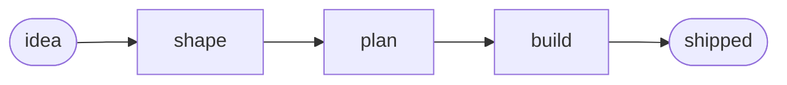

# Beautiful repo README

A README is the project's front page. A visitor decides in about ten seconds whether the
project is worth their time — the README earns that time by answering, in order: **what is
this, who is it for, is it any good, how do I use it.** Everything below serves that
reading order. Beauty is in service of scannability, never decoration for its own right.

GitHub renders a permissive subset of HTML inside Markdown, and renders ```mermaid``` fenced
blocks natively. That is the whole toolkit — no build step, no external assets required
beyond images you commit. Use HTML only where Markdown can't do the job (centering, badge
rows, side-by-side); write the body in plain Markdown so it stays editable.

## Anatomy (top to bottom)

A polished README is these blocks in this order. Skip any that don't apply — a small library
doesn't need a "Why I built this," a CLI does need a copy-paste install. Never reorder so
that "what is this" comes after "how to install."

1. **Hero** — centered, above the first `---`:
   - Optional banner image (`<p align="center"></p>`). A committed SVG or PNG in
     `assets/`. Give it real `alt` text.
   - Badge row — status at a glance (see below).
   - `<h1 align="center">` project name.
   - **One bold sentence** that says what the project is and its single best reason to exist.
     This is the most important line in the file. Write it last, after you know what you built.
   - Anchor nav for long READMEs: `<a href="#why">Why</a> · <a href="#install">Install</a> …`.
   - One plain italic line: the literal one-line description (repo tagline / etymology / scope).
2. `---` horizontal rule to close the hero.
3. **Why / the problem** — 2–4 sentences of narrative. The hook: what was broken, what this
   does about it. First person is fine for personal projects. Skip for pure utility libs.
4. **A visual** — a mermaid diagram of the flow/architecture, or a screenshot/GIF for anything
   with a UI or CLI output. One good visual beats three paragraphs.
5. **Features / contents** — a table, not a bullet dump, once there are more than ~4 items.
   Two columns (`Thing | What it does`) scan far faster than prose.
6. **Callouts** — `>` blockquotes for the two or three things a user MUST know (a prerequisite,
   a gotcha, an always-on behavior). Reserve them; if everything is a callout, nothing is.
7. **Example** — one concrete, real usage with an actual code block and realistic output.
   Show, don't tell. Fabricated output that won't match reality is worse than none.
8. **Install** — copy-paste-ready. Every command in a fenced block, runnable as-is, no
   `$` prompts to strip, no `<placeholders>` unless unavoidable (and then explain them).
9. **Use / quick start** — the shortest path from install to first result.
10. **Proven / credibility** (optional) — tests, benchmarks, users, "used in production at X."
    Only real claims. A fake metric is a permanent trust leak.
11. **Footer** — license, contributing link, acknowledgements. Short.

## Shields.io badges

Badges communicate live status in one row. Rules: **each badge must tell the truth and mean
something** — version, build, license, downloads, "no build step," core stat. Drop badges
that just decorate. Keep to one visual style so the row reads as a set.

```
<p align="center">
  
  <a href="CHANGELOG.md"></a>
  
</p>
```

- `style=flat-square` is the cleanest default; pick one style and use it for every badge.
- Underscores become spaces; `·` (middle dot) and `_` read well as separators.
- Link a badge (`<a href>`) when it points somewhere useful (changelog, CI, license).
- A tidy palette (hex, no `#` in the URL): indigo `6e56cf`, cyan `22d3ee`, green `34d399`,
  amber `f59e0b`, slate `64748b`. Use one accent + slate for neutrals; don't rainbow it.
- Prefer dynamic badges (shields' own version/CI/license endpoints) over hardcoded values
  where the repo host supports them — a hardcoded version badge goes stale silently.

## Mermaid diagrams

GitHub renders these natively. A flow or architecture diagram earns its space when the
project has a pipeline, a state machine, or multiple moving parts.

````

````

Keep it to the happy path — a diagram that tries to show every branch stops being a diagram.
Styling with `classDef` is optional; legibility beats brand colors.

## Principles

- **The one-liner is the whole game.** If a stranger reads only the bold hero sentence, they
  should know whether this is for them. Iterate on it more than any other line.
- **Scannable beats complete.** Headings, tables, short paragraphs. Depth goes in linked pages
  (`docs/`, wiki), not in the README. A README that documents everything documents nothing.
- **Copy-paste or it didn't happen.** Install and use commands must run exactly as written.
  Test them in a clean shell. This is the single most common README defect.
- **Show real output.** Screenshots, GIFs, actual command output. Realistic beats aspirational.
- **Every claim true.** Badges, metrics, "production-ready," feature lists — a visitor who
  catches one lie distrusts the rest. Under-claim before you over-claim.
- **Alt text on every image.** Accessibility, and it's what shows when the image 404s.
- **Theme-safe visuals.** READMEs render on light and dark backgrounds. Avoid images with a
  baked-in background that only works on one; transparent PNG/SVG is safest.

## No-op test

Before keeping a section, ask: does it help the reader decide or act? Cut anything that
doesn't. Common cuts: a table of contents on a short README, a badge that restates the title,
a "Features" list that repeats the one-liner, a wall of configuration that belongs in `docs/`,
an emoji on every heading. Ornament that doesn't aid scanning is noise — remove it, don't
shrink it.

## Starter skeleton

Fill in, then delete every block that doesn't apply:

````markdown
<p align="center">
  
</p>

<p align="center">
  
  
</p>

<h1 align="center">NAME</h1>

<p align="center"><b>The single sentence that says what this is and why it exists.</b></p>

<p align="center">
  <a href="#why">Why</a> · <a href="#install">Install</a> · <a href="#use">Use</a>
</p>

<p align="center"><i>One plain line: the literal scope / tagline.</i></p>

---

## Why
2–4 sentences: the problem, and what this does about it.

## Install
```sh
# copy-paste ready, runs as-is
```

## Use
```sh
# shortest path to first result
```
````
